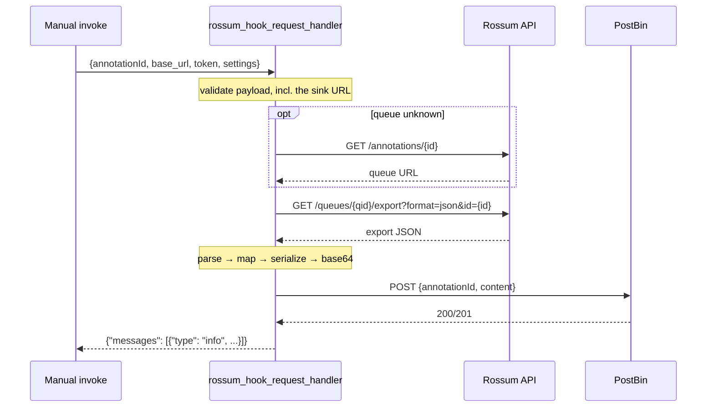

# Rossum → FinancialDocDesc → PostBin

A Rossum serverless function that takes an annotation ID, exports the annotation
from the Rossum API, maps it to the **FinancialDocDesc** XML format, base64-encodes
it, and POSTs it to an unauthenticated endpoint:

```json
{ "annotationId": "12345678", "content": "<base64 of the XML>" }
```

Entry point: `rossum_hook_request_handler(payload) -> {"messages": [...]}`

---

## How it works



The pipeline is four pure functions with I/O only at the edges, which is what
makes the whole thing testable without a network:

`parse_export` → `map_document` → `to_xml` → `post_to_sink`

---

## The mapping is declared once

The core design decision. Each XML element is declared exactly once — as a
dataclass field whose **name is the tag**, whose **position is the document
order**, and whose **metadata names the single Rossum `schema_id` it reads**:

```python
@dataclass
class EInvoice:
    InvoiceType: str = _src("document_type")
    VatCountryCode: str = _src()               # derived from VatID, not extracted
    VatID: str = _src("sender_vat_id")
    CustormerID: str = _src("recipient_ic")    # sic: the typo is the target contract
    InvoiceNumber: str = _src("document_id")
    ...
```

There is no separate field-order table, no list of candidate aliases, and no
guessing. Adding an element is one line. `_src()` with no argument marks a value
that is derived in code rather than read from the export.

A queue with a customised schema doesn't need a code change — it passes
`settings.schema_overrides`:

```json
{ "schema_overrides": { "CustormerID": "recipient_vat_id" } }
```

**Nothing is calculated.** Every amount, rate and total comes from the export as
extracted. Where Rossum has no value, the element is emitted empty rather than
inferred — an invented tax rate is worse than a blank one.

### Sources

| FinancialDocDesc | Rossum `schema_id` |
|---|---|
| `InvoiceType` | `document_type` |
| `VatID` | `sender_vat_id` |
| `VatCountryCode` | *derived* — the two-letter prefix of `VatID` |
| `CustormerID` | `recipient_ic` |
| `InvoiceNumber` | `document_id` |
| `InvoiceDate` / `DueDate` | `date_issue` / `date_due` |
| `OrderNumber` | `order_id` |
| `Currency` | `currency` |
| `Total` | `amount_total` |
| `NetAmount0` | zero-rated base from the `tax_details` rows |
| `NetAmount1..3`, `TaxAmount1..3`, `TaxRate1..3` | the rated `tax_details` rows, in order |
| `Control.Origin` | *derived* — constant `EMAIL` |
| `Control.CurrentDate` | *derived* — UTC date of the run |
| `Control.Barcode` | `barcode`, falling back to the annotation ID |
| `Lines/*` | the `line_items` rows (`item_code`, `item_description`, `item_quantity`, `item_uom`, `item_amount`, `item_rate`, `item_tax`, `item_amount_total`) |

If no `tax_details` rows were extracted, the header totals `amount_total_base` /
`amount_total_tax` fill bucket 1 and `TaxRate1` stays empty.

---

## Deploy

1. Create a serverless function hook in Rossum (Python, `default` library pack).
2. Paste `function.py`; entry point `rossum_hook_request_handler`.
3. Set the hook's settings:

```json
{ "postbin_url": "https://www.postb.in/<BIN_ID>" }
```

4. Give the hook a `token_owner` — without it Rossum does not inject
   `rossum_authorization_token` and the function cannot call the API.
5. Invoke it:

```bash
curl -X POST "https://<org>.rossum.app/api/v1/hooks/<HOOK_ID>/invoke" \
  -H "Authorization: Bearer <TOKEN>" -H "Content-Type: application/json" \
  -d '{"annotationId": "12345678"}'
```

The PostBin URL must be `https://www.postb.in/<BIN_ID>` — the `/b/` path is the
browser UI, not the POST target.

> **Outbound internet is disabled by default** for Rossum functions. Calls to the
> Rossum API work out of the box, but the POST to PostBin requires egress to be
> enabled for the organization. If it isn't, the function reports exactly that
> rather than a bare timeout.

### Overriding the sink per invocation

A `postbin_url` at the top level of the invoke body takes precedence over the
stored setting, so a test run can target a fresh bin without mutating the hook:

```bash
-d '{"annotationId": "12345678", "postbin_url": "https://www.postb.in/OTHER"}'
```

---

## Layout

| Path | Role |
|---|---|
| `function.py` | The function — paste this into Rossum |
| `tests/test_function.py` | 52 offline tests; no network |
| `samples/sample_export.json` | Rossum export fixture used by the tests |
| `samples/sample_invoke_payload.json` | Shape of a manual-invoke payload |
| `scripts/local_smoke.py` | Map the fixture and print the XML — no account needed |
| `scripts/live_e2e.py` | Live check: fresh bin → invoke → decode → validate |

---

## Tests

The function is stdlib + `requests`; the tests need nothing else.

```bash
python -m unittest discover -s tests -v      # 52 tests
python scripts/local_smoke.py                # eyeball the mapped XML
```

They cover the parse/map/serialize pipeline and every error branch of the
handler, including the ones that are easy to get wrong:

- an export returned for a **different annotation** is rejected — comparing the
  URL's last path segment, not a substring, so `123` doesn't match `.../1234`
- row values (`item_*`, `tax_detail_*`) can never leak into header fields
- an all-blank tax row must not consume a rate bucket
- `requests.HTTPError` with `response is None` must not escape the handler
- `ConnectTimeout` must be caught before `Timeout`, or the egress hint is lost
- XML-illegal control characters in OCR text are stripped, not fatal

Live e2e against a real org:

```bash
ROSSUM_DOMAIN=https://<org>.rossum.app TOKEN=<key> \
HOOK_ID=<id> ANNOTATION_ID=<id> python scripts/live_e2e.py
```

---

## Notes on the design

**`requests`, not `urllib`.** Rossum's Python 3.12 runtime ships a default
third-party pack that includes `requests` (verified on the live runtime, along
with `pandas`, `numpy`, `httpx`, `pydantic` and `xmltodict`). Sessions, timeouts
and a sane exception hierarchy are worth more than an avoided import — and the
default urllib User-Agent is rejected by some endpoints, PostBin among them.

**`ElementTree`, not `xmltodict`.** `xmltodict` is the only XML library in the
pack, but it passes control characters straight through and will emit a document
that cannot be re-parsed. It is also a *parsing* library, and this function never
parses XML — it generates it from Rossum's JSON export. ElementTree does that in
a dozen lines with one sanitisation gate that every value passes through.

**No Rossum SDK.** The runtime's `rossum` package is the CLI, not the
`rossum-api` client library; its client is built around username/password login,
sends `Authorization: Token`, has no request timeout, and revokes the token in
its context-manager exit. For two documented REST calls, a ~40-line client with
explicit timeouts and no redirect-following is the safer dependency.

**The handler never raises.** Every path returns hook messages, because an
uncaught exception in a Rossum function surfaces as an opaque failure. Error
messages name the endpoint and the likely cause — `postbin_url` is validated
before any API call, so a typo fails immediately instead of after two round
trips and a POST of invoice data to an arbitrary host.

**Timeouts.** `POST /hooks/{id}/invoke` enforces a hard 30s wall clock that
cannot be raised, and the injected token lives ~10 minutes. At most three
sequential requests run, each capped at 8s, leaving room to return an error
rather than being killed. Redirects are refused: following one would both re-arm
the timeout and forward the bearer token to another host.

### Limitations

- `Discount` and `Control.EmailTo` / `EmailFrom` have no standard Rossum
  `schema_id`; they stay empty unless pointed at a field via `schema_overrides`.
- Only the first three rated tax buckets are emitted — the target schema has
  exactly three.
- The annotation must be in an exportable state; if it isn't, the export returns
  no results and the function says so.
